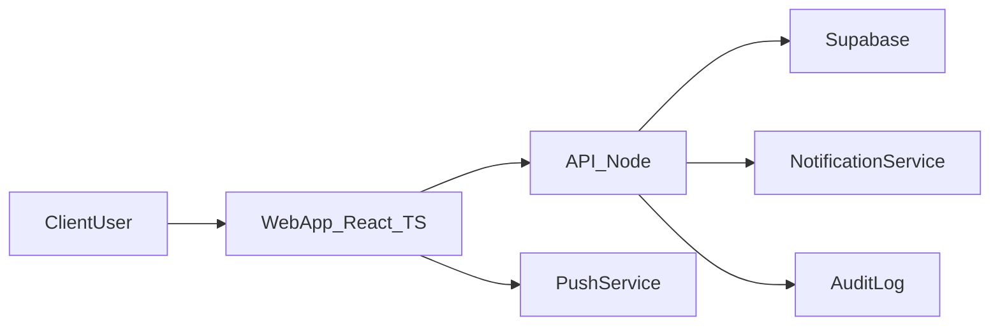

Start-My-App · Levantamento Técnico  
Projeto: Malu Borges · João (Malu Borges)  
Gerado em 10/02/2026 · Documento de análise e roadmap do projeto

---

## 1. Resumo do projeto

Este documento consolida as informações do formulário de requisitos enviado pelo cliente e as organiza em formato de **roadmap de desenvolvimento** para o aplicativo interno de gestão de campanhas da **Malu Borges**.

O aplicativo será utilizado para **organizar, executar e acompanhar campanhas de influenciador já fechadas com marcas**. Cada campanha é tratada como um **job** dentro do sistema, com:

- Escopo e vigência claros  
- Lista de entregáveis rastreáveis  
- Acompanhamento de cada entrega do início à conclusão  

O diferencial do app é o conceito de **escopo vivo**: as informações podem entrar desorganizadas (por exemplo, textos colados do WhatsApp) e o sistema, com apoio de **IA**, ajuda a:

- Organizar, limpar e estruturar o conteúdo  
- Sugerir caminhos criativos  
- Apontar pendências  

Sem foco em vendas ou CRM – o foco é **operacional, criativo e de acompanhamento de jobs**.

---

## 2. Informações de contato

- **Nome do cliente**: João (Malu Borges)  
- **E-mail**: naoinformado@naoinformado.com  
- **WhatsApp / Telefone**: (21) 96773-6940  
- **Empresa**: Malu Borges  

---

## 3. Visão geral do projeto

### 3.1 Objetivo de negócio

Permitir que o time saiba, a qualquer momento:

- **O que foi prometido** em cada job  
- **O que já foi entregue**  
- **O que ainda falta entregar**  
- **Quem está envolvido**  
- **Quais são as próximas datas importantes**  

### 3.2 Público-alvo

- **Clientes internos** da Malu Borges (equipe que gerencia campanhas e jobs com marcas).  

### 3.3 Tipos de usuários

Serão considerados três níveis principais, com possibilidade de expansão:

- **Administrador (Admin / Admin Master)**  
  - Acesso total a todas as funcionalidades do sistema.  
  - Gerencia usuários, projetos, papéis e permissões.  
  - Visualiza e controla alterações feitas pelos demais usuários.  
  - Responsável por configurar inicialmente as **seções do site** e os **papéis**.

- **Subadministrador (Subadmin)**  
  - Permissões reduzidas em relação ao Admin.  
  - Pode executar apenas funções previamente definidas.  
  - Pode delegar permissões específicas em determinadas áreas.

- **Usuários por papéis/equipes**  
  - Ex.: **Marketing**, **Criativo**, **Produção**, **Financeiro**, entre outros.  
  - Cada papel possui um conjunto de permissões associado às seções do sistema.  

O sistema deve permitir que novos papéis sejam criados dinamicamente e que as permissões sejam configuradas por seção funcional.

### 3.4 Plataformas

- **Web**  
- **Android**  
- **iOS**  

A versão web será a base principal; as versões mobile podem ser entregues via PWA ou apps nativos/híbridos em fases futuras.

---

## 4. Regras de negócio

### 4.1 Fluxos obrigatórios e restrições

- Três níveis principais de permissão: **Administrador**, **Subadministrador** e **Usuários (Marketing, Criativo, Produção, Financeiro)**.  
- O **Administrador** tem acesso total, inclusive a uma página de **auditoria** que registra todas as ações relevantes do sistema.  
- O **Subadministrador** possui um subconjunto de permissões, definido pelo Admin, podendo delegar funções específicas.  
- Os **Usuários** são atribuídos a **papéis** (ex.: Marketing, Operacional, Criativo, Financeiro), e cada papel tem um conjunto de permissões configuráveis conforme as seções do sistema.  
- O sistema deve manter **rastreamento completo das ações** importantes (criação/edição de jobs, mudança de status, alterações de permissões, etc.).

### 4.2 Permissões por tipo de usuário (RBAC)

Regras gerais:

- **Administrador**  
  - Criar, editar e remover **projetos/jobs**.  
  - Criar, editar e remover **usuários**.  
  - Criar, editar e remover **papéis**.  
  - Configurar **permissões** por papel e por seção.  
  - Acessar **painel de auditoria** completo.  

- **Subadministrador**  
  - Acessar subconjunto de funcionalidades definidas pelo Admin.  
  - Gerenciar determinados módulos (por exemplo, gestão de jobs, mas não de papéis).  
  - Não pode alterar configurações críticas de segurança ou LGPD.  

- **Usuários por papéis (Marketing, Operacional, etc.)**  
  - Acesso segmentado por área. Ex.:  
    - **Marketing**: campanhas, conteúdos, entregáveis.  
    - **Produção**: cronogramas, status de entregas, operações de campo.  
    - **Financeiro**: orçamentos, custos, status de pagamento (funcionalidades futuras).  

O sistema deve prever uma **tela de gestão de papéis e permissões**, onde o Admin possa:

- Criar novos papéis  
- Definir, para cada papel, o que pode ser feito em cada seção (criar/ler/atualizar/excluir, acesso a dashboards, etc.)  

### 4.3 Processos automáticos e IA

- Geração de **notificações automáticas** sobre:  
  - Projetos em atraso  
  - Jobs incompletos  
  - Entregáveis próximos da data ou vencidos  
- Apoio de **IA** em campos específicos, como:  
  - Organização de **briefing desestruturado** (texto colado de WhatsApp, e-mail, etc.) em campos organizados.  
  - Geração de **lista inicial de entregáveis** (reels, stories, presença em evento, etc.).  
  - **Apontar pendências** por job (entregas prometidas que ainda não foram realizadas).  
  - **Sugerir ideias criativas** por entregável.  

Esses recursos de IA serão priorizados em fases posteriores do roadmap, após estabilização do MVP.

---

## 5. Fluxo de telas e navegação

### 5.1 Lista de telas principais

- **Módulo de Login**  
  - Tela de autenticação (e-mail/senha).  
  - Fluxos de confirmação de cadastro e recuperação de senha (podem ser entregues em fase posterior).  

- **Home / Página inicial (Hero)**  
  - Layout tipo **HERO** com:  
    - Seção institucional (**Quem sou eu**)  
    - Trabalhos / portfólio  
    - Carrossel dinâmico de vídeos recentes  
  - Carrossel configurável via painel administrativo a partir de **URLs do YouTube**.  

- **Dashboard de projetos/jobs**  
  - Lista de jobs com filtros por status (em andamento, em aberto, finalizados).  
  - Indicadores visuais (cards, contadores, barras de progresso).  
  - Acesso rápido às principais métricas do pipeline de entregas.  

- **Painel Administrativo**  
  - CRUD de projetos/jobs.  
  - Cadastro/edição de entregáveis por job.  
  - Definição de escopo e vigência.  
  - Cadastro de datas importantes.  
  - Campos de **briefing livre** e **brainstorm criativo**.  

- **Painel de Perfis e Permissões**  
  - Gestão de usuários (inclusão, edição, desativação).  
  - Gestão de papéis (Admin, Subadmin, Marketing, Criativo, Produção, Financeiro, etc.).  
  - Configuração de permissões por seção do sistema.  

- **Tela de Auditoria**  
  - Lista eventos relevantes: logins, criação/edição de jobs, alterações de status, mudanças de permissões, etc.  
  - Filtros por usuário, data, tipo de ação.  

- **Telas de Relatórios e Gráficos** (fases posteriores)  
  - Gráficos de projetos em andamento, em aberto e finalizados.  
  - Métricas de **orçamento** e indicadores de performance das campanhas.  

### 5.2 Navegação (alto nível)

- Usuário faz login → acessa **Dashboard** conforme seu papel.  
- Do Dashboard, pode navegar para:  
  - Detalhe de job  
  - Criação/edição de job  
  - Módulo de permissão (se tiver acesso)  
  - Tela de auditoria (Admin/Subadmin)  
  - Home institucional (caso esteja exposta também para usuários autenticados).  

---

## 6. Funcionalidades principais

### 6.1 MVP – Funcionalidades obrigatórias

O MVP deve contemplar, no mínimo:

- **Cadastro de jobs** (campanhas já fechadas com marcas).  
- **Definição de escopo e vigência** por job.  
- **Lista de entregáveis rastreáveis** (ex.: reel, stories, presença em evento, post de feed, etc.).  
- **Status por entregável**: pendente / em produção / entregue.  
- **Datas importantes**: captação, evento, postagem, revisões, etc.  
- **Briefing livre**: campo de texto aberto, aceitando texto colado (WhatsApp, e-mail, etc.).  
- **Brainstorm criativo**: área para ideias e referências.  
- **Acompanhamento visual do que já foi entregue** (timeline, checklists, badges ou outro recurso visual).  
- **Perfis de usuário** (admin, criativo, produção, financeiro) com permissões básicas já configuradas.  
- **Primeiros recursos de IA (mínimo viável)**:  
  - Organizar briefing bagunçado em uma estrutura recomendada (títulos/descrições/campos).  
  - Apontar pendências do job de maneira simples (baseado em status dos entregáveis).  

### 6.2 Funcionalidades para fases futuras

- IA mais avançada para:  
  - Gerar lista inicial de entregáveis com base em briefing e tipo de campanha.  
  - Sugerir ideias criativas específicas para cada entrega.  
- Dashboards avançados com gráficos de indicadores e orçamento.  
- Notificações push integradas a apps mobile.  
- Integrações com outros serviços (ex.: armazenamento de vídeos, calendários, ERPs, CRMs – se vierem a ser necessários).  

---

## 7. Identidade visual e UI/UX

- Atualmente **não existe identidade visual definida** para o projeto.  
- Não há **logo** pronto.  

### Diretrizes iniciais

- Criar uma identidade visual alinhada à persona da Malu Borges (influenciadora, criativa, moderna), porém mantendo:  
  - Interface **limpa e objetiva** para uso interno diário.  
  - **Prioridade na usabilidade** sobre efeitos visuais pesados.  
- Aplicar princípios de UX:  
  - Hierarquia clara de informação (o que foi prometido, o que falta, o que está atrasado).  
  - Feedback visual ao mudar status, salvar dados, etc.  
  - Layout responsivo para web e uso em tablets/notebooks.  

---

## 8. Requisitos técnicos

### 8.1 Stack tecnológica

- **Frontend**: React com Typescript  
  - Aplicação SPA ou SPA + rotas, com gerenciamento de estado (ex.: React Query, Zustand, Redux ou similar – a ser definido na implementação).  
  - Comunicação com backend via API HTTP (REST) ou via SDK do Supabase quando fizer sentido.  

- **Backend**: Node.js  
  - Serviço de API responsável por regras de negócio, integrações e orquestração com Supabase (quando necessário).  
  - Pode ser implementado como servidor Node tradicional (Express/Fastify) ou utilizando funções serverless, conforme estratégia de deploy.  

- **Banco / BaaS**: Supabase  
  - Autenticação de usuários (e-mail/senha).  
  - Armazenamento de dados de jobs, entregáveis, usuários, papéis e auditoria (tabelas).  
  - Possíveis triggers no banco para notificações/automação em fases futuras.  

### 8.2 Estrutura geral do projeto

Proposta de estrutura em pastas:

- `frontend/`  
  - App React + Typescript.  
  - Módulos: Auth, Dashboard, Jobs, Permissões, Auditoria, Home institucional, etc.  

- `backend/`  
  - API Node.js.  
  - Módulos: Auth, Jobs, Entregáveis, Papéis & Permissões, Auditoria, Notificações, Integrações de IA.  

Essa estrutura pode ser organizada como **monorepo** ou como dois projetos separados, conforme decisão futura de deploy.

### 8.3 Escalabilidade

- Escopo inicial: **pequeno**, até **100 usuários**.  
- Priorização para:  
  - Simplicidade de arquitetura.  
  - Custo operacional reduzido.  
  - Facilidade de manutenção e evolução incremental.  

---

## 9. Segurança e dados

### 9.1 Autenticação e autorização

- **Login com e-mail e senha**.  
- Autenticação gerenciada via Supabase Auth (ou solução equivalente), com integração ao backend quando preciso.  
- Implementação de **autorização baseada em papéis (RBAC)** respeitando Admin, Subadmin e papéis por equipe.  

### 9.2 Proteção de dados

- Envio de **e-mail de confirmação de usuário** no momento do cadastro.  
- Separação de ambientes (desenvolvimento / produção).  
- Controle de acesso rigoroso ao painel de auditoria e gestão de permissões.  

### 9.3 Conformidade com LGPD

- É necessário estar em **conformidade com a LGPD**, incluindo:  
  - Termos de uso e política de privacidade claros.  
  - Registro de consentimento do usuário.  
  - Possibilidade de solicitar exclusão ou anonimização dos dados pessoais, quando aplicável.  

### 9.4 Backup, logs e monitoramento

- **Backup**: sem preferência específica; será definida uma política mínima (ex.: backups diários automáticos via provedor).  
- **Logs e monitoramento**:  
  - Painel de auditoria interno para ações de usuários.  
  - Logs de aplicação e erros em provedor externo (a definir).  

---

## 10. Comunicação e notificações

### 10.1 Notificações

- **Notificações push**:  
  - Sim, previstas no escopo, principalmente para alertas sobre jobs/entregas próximas do prazo ou atrasadas.  
  - Implementação provável em fases futuras (após consolidação do MVP web).  

- **E-mails automáticos**:  
  - Confirmação de cadastro de usuário.  
  - Possíveis avisos de alteração de status importante em jobs (futuro).  

- **SMS / WhatsApp**:  
  - Não há necessidade inicial.  

---

## 11. Cronograma e entregas (visão interna)

O cliente indicou **prazo urgente (1–2 semanas)** e preferência por **entrega final**, sem entregas parciais formais.  
Internamente, a equipe técnica deve considerar o seguinte fatiamento em fases/milestones:

### 11.1 Fase 1 – Fundamentos do sistema (MVP técnico)

- Configuração da estrutura do projeto (`frontend` e `backend`).  
- Integração inicial com Supabase (autenticação e banco de dados).  
- Modelo de dados inicial para:  
  - Usuários  
  - Papéis e permissões  
  - Jobs e entregáveis  
- Painel administrativo mínimo para criação de jobs com escopo, vigência e entregáveis.  

### 11.2 Fase 2 – Gestão de jobs e entregáveis (MVP funcional)

- CRUD completo de jobs e entregáveis.  
- Status por entregável (pendente / em produção / entregue).  
- Cadastro e visualização de datas importantes.  
- Tela de detalhe do job com visão clara do:  
  - O que foi prometido  
  - O que já foi entregue  
  - O que falta entregar  
- Dashboard simples de acompanhamento de jobs.  

### 11.3 Fase 3 – Papéis, permissões e auditoria

- Implementação de RBAC dinâmico (Admin, Subadmin, papéis por área).  
- Telas para gestão de usuários e times.  
- Painel de configuração de papéis e permissões (por seção).  
- Página de auditoria com registro de ações importantes.  

### 11.4 Fase 4 – UI/UX institucional e dashboards

- Home com bloco Hero, seção institucional, portfólio e carrossel de vídeos configurável via painel.  
- Melhorias de UX no dashboard de projetos (filtros, busca, destaques visuais).  
- Gráficos com indicadores de:  
  - Projetos em andamento  
  - Projetos em aberto  
  - Projetos finalizados  
  - Métricas de orçamento (quando o módulo financeiro estiver disponível).  

### 11.5 Fase 5 – IA e automações

- IA para organizar briefing desestruturado.  
- IA para gerar lista inicial de entregáveis.  
- IA para sugerir ideias criativas para entregas.  
- Automação de notificações (e-mail, push) baseada em triggers do banco ou serviços de fila.  

### 11.6 Fase 6 – Segurança, LGPD e operação

- Fortalecimento de políticas de segurança (armazenamento seguro, revisões de permissão).  
- Fluxos completos de confirmação de e-mail e recuperação de senha.  
- Políticas de LGPD mais detalhadas (direitos do titular, retenção de dados, etc.).  
- Estratégia de backup e observabilidade do backend (monitoramento, alertas).  

---

## 12. Manutenção, suporte e evolução

- **Manutenção contínua**: o cliente deseja contrato de manutenção para evolução e correção de problemas.  
- **Correção de bugs**: todos os bugs identificados após a entrega devem ser corrigidos.  
- **Evoluções futuras**: novas funcionalidades serão planejadas em ciclos, com base no uso real do sistema.  
- **SLA**: intermediário, com resposta em até 24h.  

---

## 13. Riscos e observações

- **Prazo curto (1–2 semanas)** para um MVP funcional requer forte priorização de escopo.  
- Recursos de **IA avançada** provavelmente serão mais aderentes a fases posteriores, após consolidação do fluxo básico de jobs.  
- A ausência de identidade visual e logo no início exige um pequeno esforço paralelo de **design** para garantir coesão visual mínima.  

---

## 14. Visão técnica resumida (diagrama)

---

## 15. Roadmap de desenvolvimento – ordem de implementação

A ordem abaixo define a **sequência recomendada de implementação** de cada funcionalidade. Desenvolva na ordem listada para manter dependências coerentes (migrations primeiro, autenticação e telas base em seguida, núcleo de jobs no centro, e papéis/permissões e auditoria ao final).

1. **Migrations**  
   Schema no Supabase: tabelas para usuários/perfis, papéis, permissões, jobs, entregáveis, datas importantes, configurações da Home (hero, carrossel) e tabela de auditoria. Seed inicial opcional (papel Admin).

2. **Tela de Login**  
   Formulário e-mail/senha, integração com Supabase Auth, redirecionamento pós-login (ex.: Dashboard), tratamento de erros e estado de loading.

3. **Tela Hero (Home)**  
   Página inicial com layout Hero: seção institucional (Quem sou eu), trabalhos/portfólio, carrossel de vídeos. Inicialmente com conteúdo estático ou lendo de config simples; depois conectada ao painel de configuração.

4. **Layout e rotas**  
   Estrutura de rotas (React Router), layout base (navbar, sidebar se necessário), rotas protegidas e redirecionamento para login quando não autenticado.

5. **Dashboard de projetos/jobs**  
   Lista de jobs com cards ou tabela, filtros por status (em aberto, em andamento, finalizado), indicadores visuais simples (contadores, progresso).

6. **CRUD de Jobs**  
   Telas de criar e editar job: nome, escopo, vigência (data início/fim), marca/cliente. Listagem e exclusão (soft delete ou hard conforme regra).

7. **Entregáveis por job**  
   Por job: lista de entregáveis (reel, stories, presença etc.), CRUD de entregável, status por item (pendente / em produção / entregue).

8. **Datas importantes**  
   Cadastro e exibição de datas por job (captação, evento, postagem, revisões). Campos data + label; exibição na tela de detalhe do job.

9. **Briefing e brainstorm**  
   Campos no job: briefing livre (textarea para texto colado) e brainstorm criativo (ideias/referências). Persistência e exibição na tela de detalhe.

10. **Acompanhamento visual**  
    Na tela de detalhe do job: visão clara do que foi prometido, entregue e pendente (timeline, checklist ou badges). Atualização conforme status dos entregáveis.

11. **Painel de configuração da Home**  
    Área admin para editar textos da seção institucional e URLs do carrossel (YouTube). Persistência em tabela de config; Hero lendo esses dados.

12. **Gráficos e indicadores**  
    No dashboard: gráficos (em andamento, em aberto, finalizados) e métricas de orçamento quando aplicável.

13. **Recursos de IA (MVP)**  
    Opcional para primeira entrega: organizar briefing em estrutura sugerida; apontar pendências do job com base nos status dos entregáveis.

14. **Painel de Papéis e Permissões**  
    Gestão de papéis (Admin, Subadmin, Marketing, Criativo, Produção, Financeiro etc.), atribuição de permissões por seção, gestão de usuários (vincular a papéis). RBAC aplicado nas rotas e ações.

15. **Painel de Auditoria**  
    Tela listando eventos (login, criação/edição de jobs, alteração de status, mudanças de permissão). Filtros por usuário, data, tipo de ação. Somente Admin (e Subadmin se permitido).

### Resumo da ordem (fluxo)

```mermaid
flowchart LR
  M[Migrations] --> L[Login]
  L --> H[Hero]
  H --> R[Rotas_Layout]
  R --> D[Dashboard_Jobs]
  D --> C[CRUD_Jobs]
  C --> E[Entregaveis]
  E --> T[Datas]
  T --> B[Briefing_Brainstorm]
  B --> V[Visao_Entregas]
  V --> P[Config_Home]
  P --> G[Graficos]
  G --> IA[IA_MVP]
  IA --> RBAC[Papeis_Permissoes]
  RBAC --> AUD[Auditoria]
```

---

Este roadmap serve como **documento vivo** para guiar o desenvolvimento do app Malu Borges, permitindo que o time técnico e o cliente tenham uma visão clara do escopo atual, prioridades e próximas fases de evolução.

